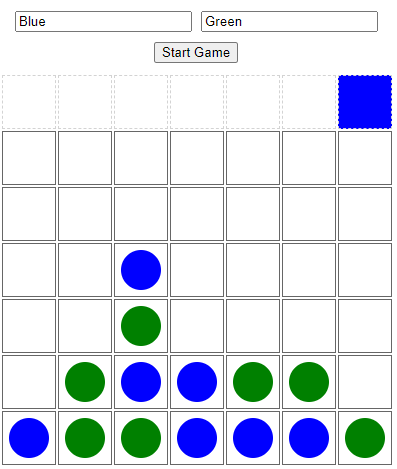

# Exercise - Connect-Four Game refactored for OOP
In this exercise, I was provided with the base Connect-Four code and I refactored it to an Object Oriented Programming format by using Classes. I also added functionality to allow for user input on the player colors, and the styling updates accordingly. If the color is invalid, the default color will be gray.

     

